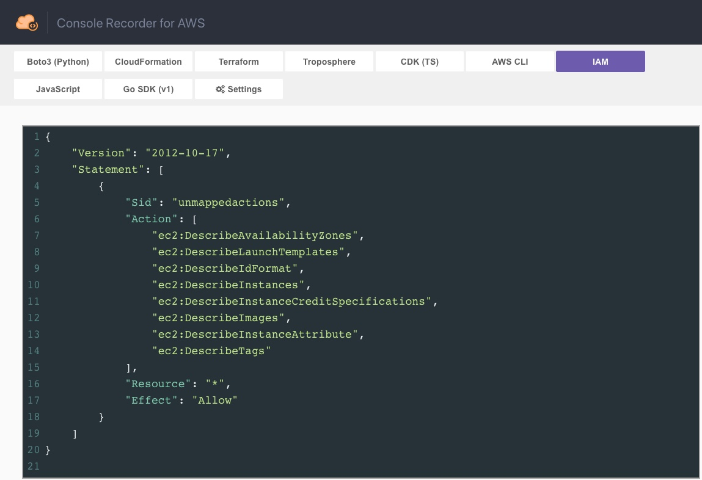

# AWS IAM Policy Templates

The purpose of this article is to provide suggestions that will help harden security and keep the operating cost low for lab environments. 
Additionally, a few baseline AWS IAM templates are also provided .

## Recommended Steps

1. Download and install the **Console Recorder for AWS** tool. Supported platforms are [Firefox](https://addons.mozilla.org/en-US/firefox/addon/console-recorder/) or [Chrome](https://chrome.google.com/webstore/detail/console-recorder-for-aws/ganlhgooidfbijjidcpkeaohjnkeicba?hl=en).
2. Make sure you use an AWS account with unrestricted access to perform the below steps.
3. Click the **Start Recording** button on **Console Recorder for AWS**.   
4. Start working on the lab and try to stick to the lab instructions.
5. After you conclude the lab, click the **Stop Recording** button on **Console Recorder for AWS**.    
6. The **AWS IAM** tab will contain the required policy.   
7. Create a new IAM policy using the policy document generated in the earlier step.   **NOTE**: The above tool has been developed independently and may contain some bugs. Therefore, please remember to review the policy and make sure it covers all the required areas.
8. The above policy would be a good starting point for security, as it limits a user's actions. But, the policy may have a few limitations.   **E.G.**: The policy may capture the *ec2:RunInstances* action. However, how would you specify a list of instance types that should be used? To make it easy to implement these kind of requirements, explore the additional lab policies included in this repository.
9. Customise the final policy as required before applying the above policy to lab users.
10. Finally make sure to test your policy before release.