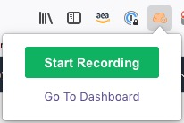
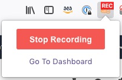

# IAM Templates

This repository provides multiple baseline IAM templates.
The purpose is to harden security and keep the operating cost low for lab environments, while giving individuals limited freedom to experiment.

## Recommended Steps

1. Download and install the **Console Recorder for AWS** tool for [Firefox](https://addons.mozilla.org/en-US/firefox/addon/console-recorder/) or [Chrome](https://chrome.google.com/webstore/detail/console-recorder-for-aws/ganlhgooidfbijjidcpkeaohjnkeicba?hl=en).
2. Make sure you use an AWS account with unrestricted access to perform the below steps.
3. Click the **Start Recording** button on **Console Recorder for AWS** .   
4. Start working on the lab and try to stick to instructions.
5. After you conclude the lab, click **Stop Recording** button on **Console Recorder for AWS**.    
6. The **IAM** tab will contain the required policy with restrictions for individuals.   
7. Create a new policy using the policy document generated in the earlier step.   **NOTE**: The above tool has been developed independently and may contain some bugs. Therefore, please remember to review the policy once and make sure it covers all required areas.
8. Finally, the above policy would be good for a security, as it limits a user's actions. However, the policy would have a few limitations.   **E.G.**: The policy may capture the *ec2:RunInstances* action. However, how would you specify a list of instance types that could be used? To make it easy to implement these kind of requirements, explore the additional lab policies included in this repository.
9. Customise the final policy as required before applying the above policy to lab users.